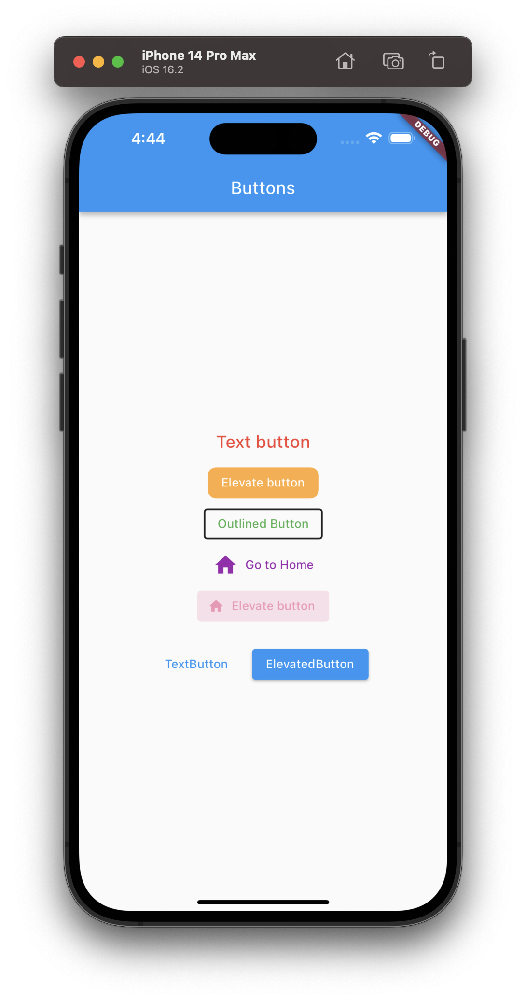
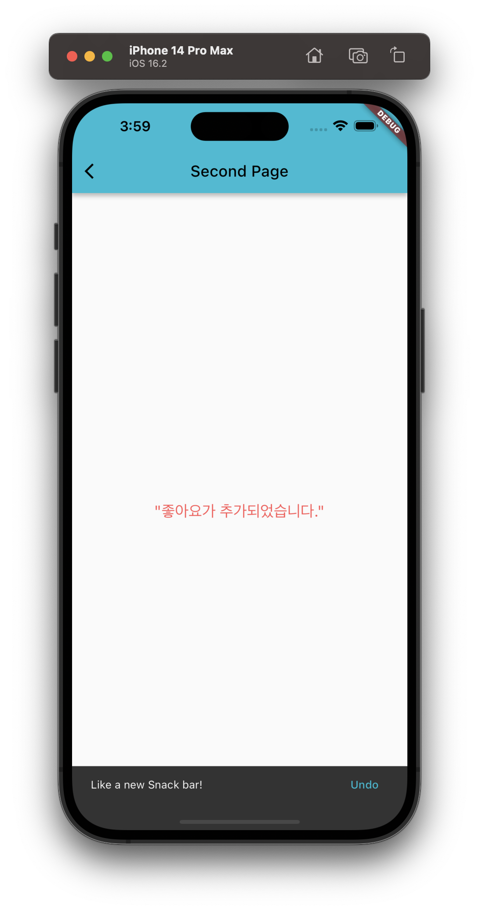

# practice_code

Flutter practice code.
Based on Flutter Lectures I studied on the coding chef YouTube channel.

해당 코드들은 코딩쉐프 유튜브 채널, 플러터 강의를 보고 공부 내용을 올린 소스 입니다.

https://www.youtube.com/@codingchef

## This Ref Lecture Link
https://www.youtube.com/watch?v=7E8l9ggxz-Q&list=PLQt_pzi-LLfpcRFhWMywTePfZ2aPapvyl&index=20

## Sample
* SnackBar without builder (main_snack.dart)

* Toast Message (main.dart)
